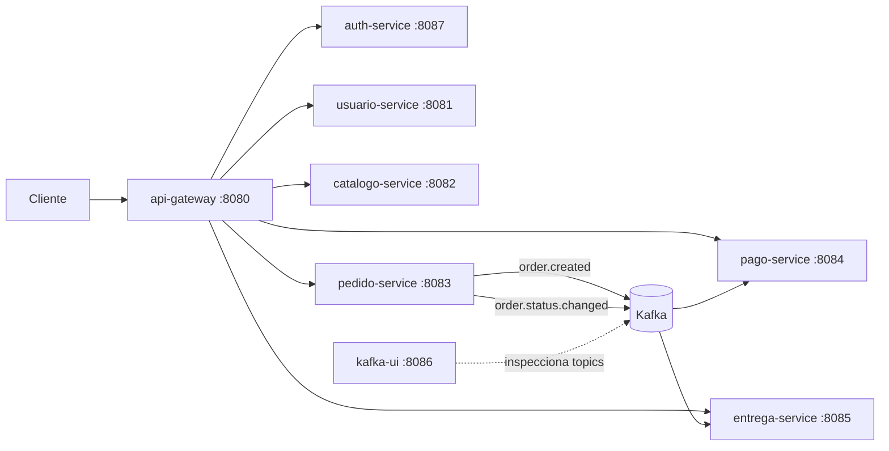
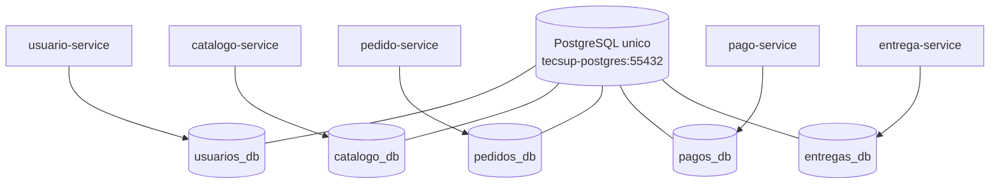

# Sistema de Pedidos de Comida - Microservicios Hexagonales

Proyecto final con arquitectura de microservicios en Java 21, usando Spring Boot, API Gateway, autenticacion centralizada con JWT, Kafka y PostgreSQL.

## Descripcion General

El sistema esta compuesto por 7 servicios de aplicacion y 3 servicios de infraestructura:

| Tipo | Servicio | Puerto interno | Expuesto | Responsabilidad |
|------|----------|----------------|----------|-----------------|
| Aplicacion | `api-gateway` | 8080 | 8080 | Punto de entrada unico para clientes |
| Aplicacion | `auth-service` | 8087 | interno | Login central y emision de JWT |
| Aplicacion | `usuario-service` | 8081 | interno | Gestion basica de usuarios |
| Aplicacion | `catalogo-service` | 8082 | interno | Registro y listado de productos |
| Aplicacion | `pedido-service` | 8083 | interno | Creacion de pedidos y transicion de estados |
| Aplicacion | `pago-service` | 8084 | interno | Registro/listado de pagos y sincronizacion por eventos |
| Aplicacion | `entrega-service` | 8085 | interno | Registro/listado de entregas y sincronizacion por eventos |
| Infraestructura | `postgres` | 5432 | 55432 | Motor PostgreSQL unico con multiples bases |
| Infraestructura | `kafka` | 9092 | 9092 | Broker de mensajeria asincrona |
| Infraestructura | `kafka-ui` | 8080 | 8086 | UI para inspeccionar topics y mensajes |

## Diagrama de Comunicacion



## Relacion Servicio - Base de Datos

| Servicio | Base de datos en PostgreSQL | Tabla principal |
|----------|-----------------------------|-----------------|
| `usuario-service` | `usuarios_db` | `users` |
| `catalogo-service` | `catalogo_db` | `products` |
| `pedido-service` | `pedidos_db` | `orders` |
| `pago-service` | `pagos_db` | `payments` |
| `entrega-service` | `entregas_db` | `deliveries` |



## Arquitectura

### Patron por servicio

Cada microservicio de negocio implementa esquema hexagonal:

- `domain`: modelos de dominio puros.
- `application`: casos de uso y puertos.
- `infrastructure/rest`: controladores y DTOs.
- `infrastructure/persistence`: JPA y repositorios.
- `infrastructure/messaging`: productores/consumidores Kafka (cuando aplica).

### Seguridad

- Login central en `auth-service`.
- Credenciales fijas para entorno actual: `admin` / `miContrasen@`.
- `api-gateway` exige JWT para rutas de negocio.
- Los microservicios tambien validan el token JWT (defensa en profundidad).

### Base de datos

Una sola instancia PostgreSQL con multiples bases:

- `usuarios_db`
- `catalogo_db`
- `pedidos_db`
- `pagos_db`
- `entregas_db`

Cada servicio tiene `schema.sql` y `data.sql` para recrear tablas y datos semilla al iniciar.

### Mensajeria

Topics usados actualmente:

- `order.created`
- `order.status.changed`

## Flujo Funcional Resumido

1. Cliente hace login en `POST /api/auth/login` via gateway.
2. Cliente crea pedido en `POST /api/orders`.
3. `pedido-service` publica `order.created`.
4. `pago-service` crea pago `PENDING` y `entrega-service` crea entrega `PENDING_ASSIGNMENT`.
5. Cliente avanza el estado del pedido por `PATCH /api/orders/{orderId}/status`.
6. `pedido-service` publica `order.status.changed`.
7. `pago-service` y `entrega-service` sincronizan sus estados.

Cadena de estados soportada para pedidos:

`CREATED -> PAYMENT_CONFIRMED -> PREPARING -> OUT_FOR_DELIVERY -> DELIVERED -> FINALIZED`

## Tecnologias

- Java 21
- Spring Boot 3.3.2
- Spring Cloud Gateway
- Spring Security Resource Server (JWT)
- Spring Data JPA
- Apache Kafka 3.7.1
- PostgreSQL 16
- Docker Compose

## Prerrequisitos

- Docker Desktop
- Java 21
- Maven 3.9+

## Ejecucion Rapida

### 1) Compilar

```bash
mvn clean package -DskipTests
```

### 2) Levantar todo

```bash
docker compose -p tecsup-pedido-comida up -d --build
```

### 3) Verificar contenedores

```bash
docker compose -p tecsup-pedido-comida ps
```

### 4) Abrir Kafka UI

- URL: `http://localhost:8086`

## Endpoints Principales (via Gateway)

Base URL: `http://localhost:8080`

- `POST /api/auth/login`
- `POST /api/users`
- `GET /api/users`
- `POST /api/products`
- `GET /api/products`
- `POST /api/orders`
- `GET /api/orders`
- `PATCH /api/orders/{orderId}/status`
- `GET /api/payments`
- `GET /api/deliveries`

## Prueba Minima con Curl

```bash
# Login
curl -X POST http://localhost:8080/api/auth/login \
  -H "Content-Type: application/json" \
  -d '{"username":"admin","password":"miContrasen@"}'

# Crear orden (usar token recibido)
curl -X POST http://localhost:8080/api/orders \
  -H "Authorization: Bearer <TOKEN>" \
  -H "Content-Type: application/json" \
  -d '{"userId":1,"totalAmount":88.50}'
```

## Documentacion Relacionada

- `README_FUNCIONAL.md`: flujo funcional y pruebas paso a paso.
- `README_ARCHIVOS.md`: estructura de carpetas y archivos clave.
- `README_ENUNCIADO.md`: mapeo requisito -> implementacion.
