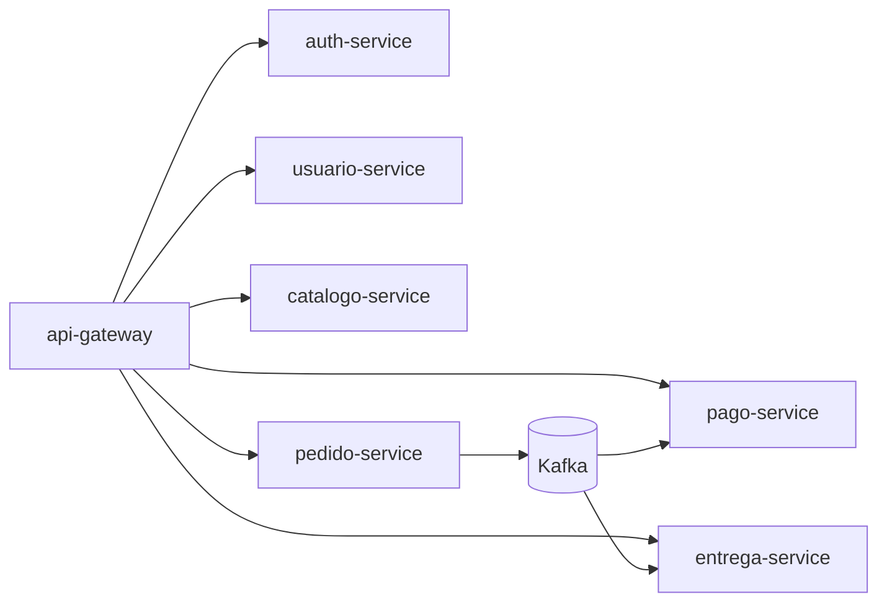
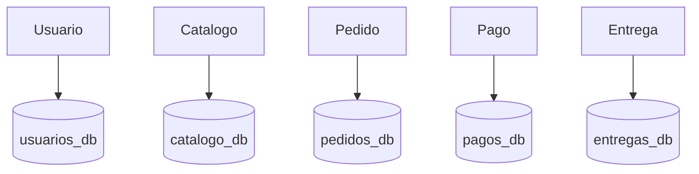

# Estructura de Archivos del Proyecto

Guia de carpetas y archivos principales del repositorio `tecsup-pedido-comida`.

## Archivos Raiz

| Archivo | Para que sirve |
|---------|----------------|
| `pom.xml` | Padre Maven multi-modulo con Java 21 y dependencias compartidas |
| `docker-compose.yml` | Orquesta toda la solucion (gateway, auth, microservicios, PostgreSQL, Kafka y Kafka UI) |
| `README.md` | Documentacion principal del proyecto |
| `README_ARCHIVOS.md` | Este documento |
| `README_ENUNCIADO.md` | Mapeo de cumplimiento de requisitos |
| `README_FUNCIONAL.md` | Guia funcional y pruebas por API |

## Modulos Maven

Definidos en `pom.xml`:

- `common-kernel`
- `auth-service`
- `api-gateway`
- `usuario-service`
- `catalogo-service`
- `pedido-service`
- `pago-service`
- `entrega-service`

## Infraestructura

## Mapa Visual de Relaciones

### `infra/postgres/`

| Archivo | Funcion |
|---------|---------|
| `init-multiple-dbs.sh` | Crea bases, usuarios y permisos para todos los servicios |

### Servicios Docker relevantes

| Servicio | Archivo relacionado |
|----------|--------------------|
| `postgres` | `docker-compose.yml` |
| `kafka` | `docker-compose.yml` |
| `kafka-ui` | `docker-compose.yml` |
| `api-gateway` | `api-gateway/Dockerfile` |
| `auth-service` | `auth-service/Dockerfile` |
| `usuario-service` | `usuario-service/Dockerfile` |
| `catalogo-service` | `catalogo-service/Dockerfile` |
| `pedido-service` | `pedido-service/Dockerfile` |
| `pago-service` | `pago-service/Dockerfile` |
| `entrega-service` | `entrega-service/Dockerfile` |

## Estructura Comun por Microservicio

Patron base (hexagonal):

- `domain/`: modelo de negocio.
- `application/`: casos de uso y puertos.
- `infrastructure/rest/`: controllers y DTOs.
- `infrastructure/persistence/`: entidades JPA, repositorios, adaptadores.
- `infrastructure/security/`: configuracion JWT resource server.
- `infrastructure/messaging/`: listeners/publicadores Kafka (si aplica).
- `src/main/resources/application.yml`: configuracion del servicio.
- `src/main/resources/schema.sql` y `data.sql`: estructura y semillas.

## Archivos Clave por Servicio

### `auth-service`

| Archivo | Funcion |
|---------|---------|
| `auth-service/src/main/java/com/tecsup/pedidocomida/auth/rest/AuthController.java` | Endpoint `POST /api/auth/login` |
| `auth-service/src/main/java/com/tecsup/pedidocomida/auth/security/JwtTokenService.java` | Genera JWT |
| `auth-service/src/main/java/com/tecsup/pedidocomida/auth/security/SecurityConfig.java` | Reglas de seguridad del servicio |

### `api-gateway`

| Archivo | Funcion |
|---------|---------|
| `api-gateway/src/main/resources/application.yml` | Rutas hacia todos los microservicios |
| `api-gateway/src/main/java/com/tecsup/pedidocomida/gateway/security/SecurityConfig.java` | Validacion JWT en gateway |

### `usuario-service`

| Archivo | Funcion |
|---------|---------|
| `usuario-service/src/main/java/com/tecsup/pedidocomida/usuario/infrastructure/rest/UserController.java` | Endpoints `POST/GET /api/users` |
| `usuario-service/src/main/java/com/tecsup/pedidocomida/usuario/application/CreateUserUseCase.java` | Caso de uso de alta de usuario |
| `usuario-service/src/main/resources/schema.sql` | Tabla `users` |

### `catalogo-service`

| Archivo | Funcion |
|---------|---------|
| `catalogo-service/src/main/java/com/tecsup/pedidocomida/catalogo/infrastructure/rest/ProductController.java` | Endpoints `POST/GET /api/products` |
| `catalogo-service/src/main/java/com/tecsup/pedidocomida/catalogo/application/CreateProductUseCase.java` | Caso de uso de alta de producto |
| `catalogo-service/src/main/resources/schema.sql` | Tabla `products` |

### `pedido-service`

| Archivo | Funcion |
|---------|---------|
| `pedido-service/src/main/java/com/tecsup/pedidocomida/pedido/infrastructure/rest/OrderController.java` | Endpoints `POST/GET /api/orders` y `PATCH /api/orders/{id}/status` |
| `pedido-service/src/main/java/com/tecsup/pedidocomida/pedido/application/UpdateOrderStatusUseCase.java` | Reglas de transicion de estado |
| `pedido-service/src/main/java/com/tecsup/pedidocomida/pedido/infrastructure/messaging/KafkaOrderPublisher.java` | Publica `order.created` y `order.status.changed` |
| `pedido-service/src/main/resources/schema.sql` | Tabla `orders` |

### `pago-service`

| Archivo | Funcion |
|---------|---------|
| `pago-service/src/main/java/com/tecsup/pedidocomida/pago/infrastructure/rest/PaymentController.java` | Endpoint `GET /api/payments` |
| `pago-service/src/main/java/com/tecsup/pedidocomida/pago/infrastructure/messaging/OrderCreatedPaymentListener.java` | Consume `order.created` |
| `pago-service/src/main/java/com/tecsup/pedidocomida/pago/infrastructure/messaging/OrderStatusChangedPaymentListener.java` | Consume `order.status.changed` |
| `pago-service/src/main/resources/schema.sql` | Tabla `payments` (`order_id` unico) |

### `entrega-service`

| Archivo | Funcion |
|---------|---------|
| `entrega-service/src/main/java/com/tecsup/pedidocomida/entrega/infrastructure/rest/DeliveryController.java` | Endpoint `GET /api/deliveries` |
| `entrega-service/src/main/java/com/tecsup/pedidocomida/entrega/infrastructure/messaging/OrderCreatedDeliveryListener.java` | Consume `order.created` |
| `entrega-service/src/main/java/com/tecsup/pedidocomida/entrega/infrastructure/messaging/OrderStatusChangedDeliveryListener.java` | Consume `order.status.changed` |
| `entrega-service/src/main/resources/schema.sql` | Tabla `deliveries` (`order_id` unico) |

## Convenciones Aplicadas

- Java 21 en todos los modulos.
- Spring Boot 3.3.2.
- Un `Dockerfile` por servicio.
- Un `application.yml` por servicio.
- Inicializacion SQL automatica con `schema.sql` + `data.sql`.
- Seguridad JWT en gateway y microservicios de negocio.
