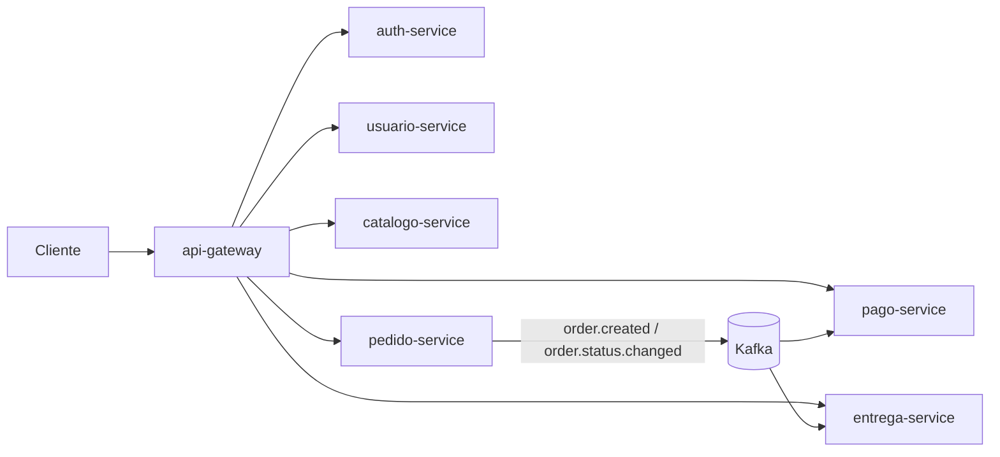
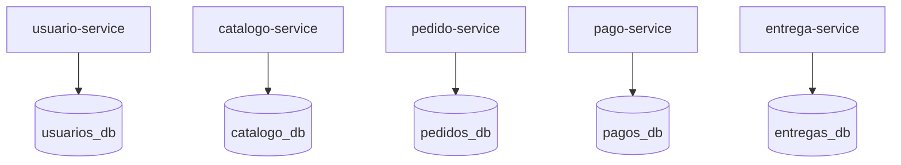

# Como se Cumple el Enunciado del Trabajo Final

Este documento mapea los requisitos del proyecto con su implementacion real en este repositorio.

## 1. Introduccion General

### 1.1 Proposito

Implementar un sistema de pedidos de comida con arquitectura de microservicios, usando Java 21, esquema hexagonal, Docker y eventos asincronicos.

### 1.2 Alcance Implementado

| Requisito funcional | Estado | Evidencia |
|---------------------|--------|-----------|
| Gestion de usuarios | Cumplido | `POST/GET /api/users` |
| Gestion de productos | Cumplido | `POST/GET /api/products` |
| Creacion de pedidos | Cumplido | `POST /api/orders` |
| Cambio de estado de pedido | Cumplido | `PATCH /api/orders/{orderId}/status` |
| Registro de pago por evento | Cumplido | `order.created` -> pago `PENDING` |
| Registro de entrega por evento | Cumplido | `order.created` -> entrega `PENDING_ASSIGNMENT` |

## 2. Vision Arquitectonica

### 2.1 Estilo Arquitectonico

Se aplico arquitectura de microservicios con capas hexagonales por servicio.

### 2.2 Servicios Implementados

| Servicio | Rol |
|----------|-----|
| `api-gateway` | Entrada unica de APIs |
| `auth-service` | Autenticacion central y JWT |
| `usuario-service` | Usuarios |
| `catalogo-service` | Catalogo |
| `pedido-service` | Pedidos y estado |
| `pago-service` | Pagos |
| `entrega-service` | Entregas |

### 2.3 Comunicacion

- Sincrona: cliente -> gateway -> microservicio (HTTP REST).
- Asincrona: Kafka con topics:
  - `order.created`
  - `order.status.changed`

Diagrama de referencia:

## 3. Cumplimiento Tecnico

### 3.1 Java 21

Cumplido. Definido en `pom.xml` del proyecto padre con `<java.version>21</java.version>`.

### 3.2 Docker en un solo grupo

Cumplido. Se usa `docker compose -p tecsup-pedido-comida ...`.

### 3.3 PostgreSQL unico con multiples bases

Cumplido. Un solo contenedor `tecsup-postgres` y bases:

- `usuarios_db`
- `catalogo_db`
- `pedidos_db`
- `pagos_db`
- `entregas_db`

Relacion servicio-base de datos:

### 3.4 Evitar puertos host conflictivos

Cumplido. PostgreSQL se expone en `55432:5432`.

## 4. Seguridad

### 4.1 Autenticacion central

Cumplido. `auth-service` expone `POST /api/auth/login` y emite JWT.

### 4.2 API Gateway

Cumplido. `api-gateway` enruta a todos los servicios y valida JWT.

### 4.3 Validacion JWT en microservicios

Cumplido. Cada servicio de negocio incluye configuracion de seguridad JWT.

## 5. Modelo de Datos e Inicializacion

### 5.1 Inicializacion automatica

Cumplido. Cada servicio posee `schema.sql` y `data.sql`, con `spring.sql.init.mode=always`.

### 5.2 Idempotencia para pago/entrega por orden

Cumplido. En `pago-service` y `entrega-service`, `order_id` es unico y se evita duplicar registros.

## 6. Flujo de Estados de Pedido

### 6.1 Transiciones permitidas

Cumplido. Implementadas en `UpdateOrderStatusUseCase`:

`CREATED -> PAYMENT_CONFIRMED -> PREPARING -> OUT_FOR_DELIVERY -> DELIVERED -> FINALIZED`

### 6.2 Propagacion a pagos y entregas

Cumplido. `pedido-service` publica `order.status.changed`, y los listeners de `pago-service` y `entrega-service` actualizan sus estados.

## 7. Evidencias de Implementacion

| Tema | Archivo clave |
|------|---------------|
| Rutas del gateway | `api-gateway/src/main/resources/application.yml` |
| Login y JWT | `auth-service/src/main/java/com/tecsup/pedidocomida/auth/rest/AuthController.java` |
| Transicion de estados | `pedido-service/src/main/java/com/tecsup/pedidocomida/pedido/application/UpdateOrderStatusUseCase.java` |
| Publicacion de eventos | `pedido-service/src/main/java/com/tecsup/pedidocomida/pedido/infrastructure/messaging/KafkaOrderPublisher.java` |
| Consumo en pagos | `pago-service/src/main/java/com/tecsup/pedidocomida/pago/infrastructure/messaging/OrderStatusChangedPaymentListener.java` |
| Consumo en entregas | `entrega-service/src/main/java/com/tecsup/pedidocomida/entrega/infrastructure/messaging/OrderStatusChangedDeliveryListener.java` |
| Infraestructura completa | `docker-compose.yml` |

## Resumen Final de Cumplimiento

| # | Requisito | Estado |
|---|-----------|--------|
| 1 | Microservicios independientes | Cumplido |
| 2 | Esquema hexagonal | Cumplido |
| 3 | Java 21 | Cumplido |
| 4 | Docker compose en un grupo unico | Cumplido |
| 5 | PostgreSQL unico con multiples bases | Cumplido |
| 6 | Kafka para eventos asincronicos | Cumplido |
| 7 | Gateway + Auth central | Cumplido |
| 8 | JWT validado en cadena | Cumplido |
| 9 | Flujo de estados completo | Cumplido |
| 10 | Inicializacion de tablas y seed | Cumplido |
