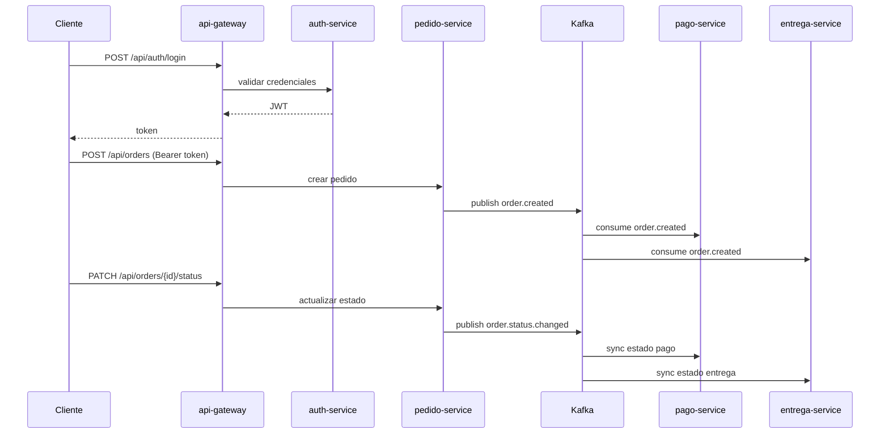
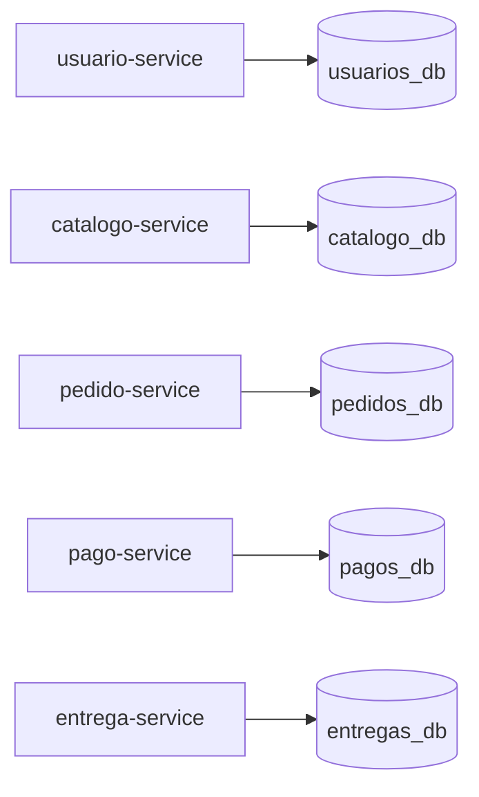

# Guia Funcional - Sistema de Pedidos de Comida

Este documento explica el flujo funcional del sistema y como probarlo de extremo a extremo usando el API Gateway.

## 1. Base URL y Seguridad

- Base URL unica: `http://localhost:8080`
- Login: `POST /api/auth/login`
- Credenciales actuales: `admin` / `miContrasen@`
- Header para endpoints protegidos:

```http
Authorization: Bearer <TOKEN>
```

## 2. Flujo Funcional Resumido

```text
1) Login en auth-service (via gateway) -> JWT
2) Crear producto
3) Crear pedido (status CREATED)
4) pedido-service publica order.created
5) pago-service crea pago PENDING
6) entrega-service crea entrega PENDING_ASSIGNMENT
7) Avanzar estado del pedido por PATCH
8) pedido-service publica order.status.changed
9) pago-service y entrega-service sincronizan estado
```

## 2.1 Diagrama de Comunicacion



## 2.2 Relacion Servicio - Base de Datos

| Servicio | Base de datos |
|----------|---------------|
| `usuario-service` | `usuarios_db` |
| `catalogo-service` | `catalogo_db` |
| `pedido-service` | `pedidos_db` |
| `pago-service` | `pagos_db` |
| `entrega-service` | `entregas_db` |



## 3. Endpoints Disponibles (via Gateway)

| Metodo | Endpoint | Descripcion |
|--------|----------|-------------|
| POST | `/api/auth/login` | Login y emision de token |
| POST | `/api/users` | Crear usuario |
| GET | `/api/users` | Listar usuarios |
| POST | `/api/products` | Crear producto |
| GET | `/api/products` | Listar productos |
| POST | `/api/orders` | Crear pedido |
| GET | `/api/orders` | Listar pedidos |
| PATCH | `/api/orders/{orderId}/status` | Cambiar estado del pedido |
| GET | `/api/payments` | Listar pagos |
| GET | `/api/deliveries` | Listar entregas |

## 4. Topics Kafka

| Topic | Publica | Consume |
|-------|---------|---------|
| `order.created` | `pedido-service` | `pago-service`, `entrega-service` |
| `order.status.changed` | `pedido-service` | `pago-service`, `entrega-service` |

UI de Kafka: `http://localhost:8086`

## 5. Estados y Reglas

### Pedido

`CREATED -> PAYMENT_CONFIRMED -> PREPARING -> OUT_FOR_DELIVERY -> DELIVERED -> FINALIZED`

### Pago

- Inicial por evento `order.created`: `PENDING`
- Al recibir `order.status.changed` desde `PAYMENT_CONFIRMED` en adelante: `PAID`

### Entrega

- Inicial por evento `order.created`: `PENDING_ASSIGNMENT`
- Por `order.status.changed`:
  - `PREPARING -> PREPARING`
  - `OUT_FOR_DELIVERY -> EN_ROUTE`
  - `DELIVERED -> DELIVERED`
  - `FINALIZED -> FINALIZED`

## 6. Prueba Paso a Paso

### Paso 1: Login

```bash
curl -X POST http://localhost:8080/api/auth/login \
  -H "Content-Type: application/json" \
  -d '{"username":"admin","password":"miContrasen@"}'
```

Respuesta esperada: objeto con `token`.

### Paso 2: Crear producto

```bash
curl -X POST http://localhost:8080/api/products \
  -H "Authorization: Bearer <TOKEN>" \
  -H "Content-Type: application/json" \
  -d '{"name":"Pizza Margherita","restaurant":"La Trattoria","price":35.90}'
```

### Paso 3: Crear pedido

```bash
curl -X POST http://localhost:8080/api/orders \
  -H "Authorization: Bearer <TOKEN>" \
  -H "Content-Type: application/json" \
  -d '{"userId":1,"totalAmount":71.80}'
```

Guardar `id` del pedido.

### Paso 4: Verificar alta automatica en pago/entrega

```bash
curl -H "Authorization: Bearer <TOKEN>" http://localhost:8080/api/payments
curl -H "Authorization: Bearer <TOKEN>" http://localhost:8080/api/deliveries
```

Esperado para ese `orderId`:

- Pago: `PENDING`
- Entrega: `PENDING_ASSIGNMENT`

### Paso 5: Avanzar estados del pedido

```bash
curl -X PATCH http://localhost:8080/api/orders/<ORDER_ID>/status \
  -H "Authorization: Bearer <TOKEN>" \
  -H "Content-Type: application/json" \
  -d '{"status":"PAYMENT_CONFIRMED"}'

curl -X PATCH http://localhost:8080/api/orders/<ORDER_ID>/status \
  -H "Authorization: Bearer <TOKEN>" \
  -H "Content-Type: application/json" \
  -d '{"status":"PREPARING"}'

curl -X PATCH http://localhost:8080/api/orders/<ORDER_ID>/status \
  -H "Authorization: Bearer <TOKEN>" \
  -H "Content-Type: application/json" \
  -d '{"status":"OUT_FOR_DELIVERY"}'

curl -X PATCH http://localhost:8080/api/orders/<ORDER_ID>/status \
  -H "Authorization: Bearer <TOKEN>" \
  -H "Content-Type: application/json" \
  -d '{"status":"DELIVERED"}'

curl -X PATCH http://localhost:8080/api/orders/<ORDER_ID>/status \
  -H "Authorization: Bearer <TOKEN>" \
  -H "Content-Type: application/json" \
  -d '{"status":"FINALIZED"}'
```

### Paso 6: Verificacion final

```bash
curl -H "Authorization: Bearer <TOKEN>" http://localhost:8080/api/orders
curl -H "Authorization: Bearer <TOKEN>" http://localhost:8080/api/payments
curl -H "Authorization: Bearer <TOKEN>" http://localhost:8080/api/deliveries
```

Esperado para el pedido de prueba:

- Pedido: `FINALIZED`
- Pago: `PAID`
- Entrega: `FINALIZED`

## 7. Checklist de Validacion

- [ ] Login exitoso y token valido.
- [ ] Creacion de producto correcta.
- [ ] Creacion de pedido con estado `CREATED`.
- [ ] Creacion automatica de pago `PENDING`.
- [ ] Creacion automatica de entrega `PENDING_ASSIGNMENT`.
- [ ] Publicacion visible en topic `order.created`.
- [ ] Transiciones de pedido respetan la secuencia permitida.
- [ ] Publicacion visible en topic `order.status.changed`.
- [ ] Pago termina en `PAID`.
- [ ] Entrega termina en `FINALIZED`.

## 8. Soporte Operativo

Comandos utiles:

```bash
docker compose -p tecsup-pedido-comida ps
docker compose -p tecsup-pedido-comida logs pedido-service --tail 100
docker compose -p tecsup-pedido-comida logs pago-service --tail 100
docker compose -p tecsup-pedido-comida logs entrega-service --tail 100
```
